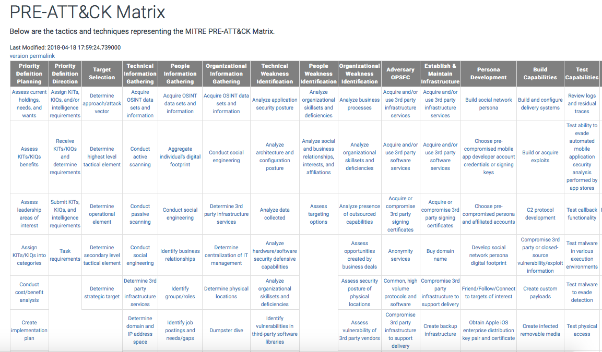
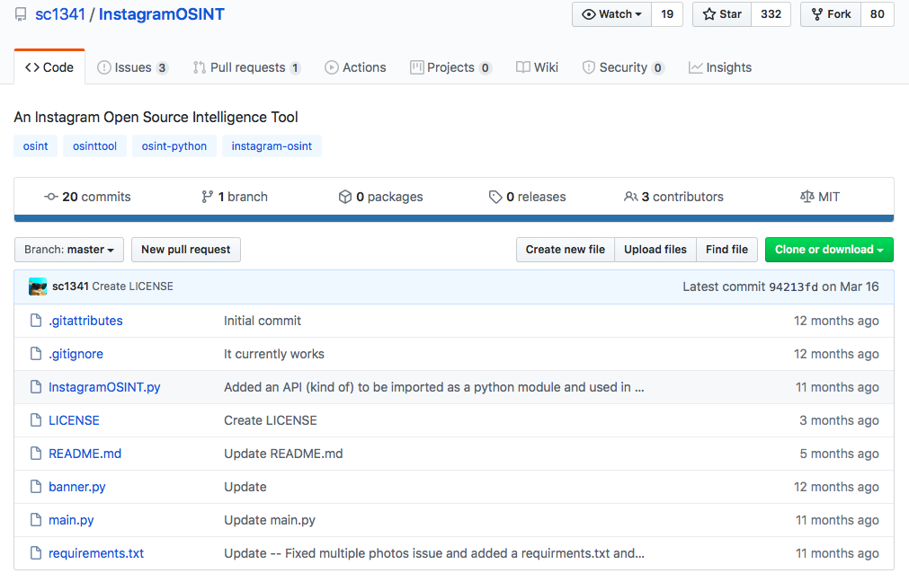
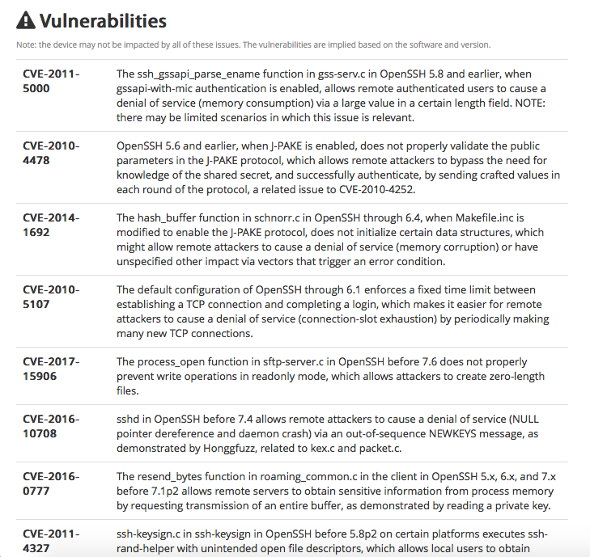

# **How to use the MITRE PRE-ATT&amp;CK framework to enhance your reconnaissance assessments**

 In this module we are going to explore how to enrich reconnaissance assessments using the MITRE Pre-ATT&amp;CK framework.

## MITRE ATT&amp;CK Framework

MITRE ATT&amp;CK is a framework developed by the Mitre Corporation. The comprehensive document classifies adversary attacks, in other words, their techniques and tactics after observing millions of real-world attacks against many different organizations. This is why ATT&amp;CK refers to &quot;Adversarial Tactics, Techniques &amp; Common Knowledge&quot;.

Nowadays the frameworks provide different matrices: [Enterprise](https://attack.mitre.org/matrices/enterprise/), [Mobile](https://attack.mitre.org/matrices/mobile/), and [PRE-ATT&amp;CK](https://attack.mitre.org/matrices/pre/). Each matrix contains different tactics and each tactic has many techniques.

According to its official website:

> Building on ATT&CK, PRE-ATT&CK provides the ability to prevent an attack before the adversary has a chance to get in. The 15 tactic categories for PRE-ATT&CK were derived from the first two stages (recon and weaponize) of a seven-stage Cyber Attack Lifecycle (first articulated by Lockheed Martin as the Cyber Kill Chain)

The Cyber Kill Chain is a military inspired model to describe the required steps and stages to perform attacks. The Cyber Kill Chain framework is created by Lockheed Martin as part of the Intelligence Driven Defense model for identification and prevention of cyber intrusions activity.

But wait, what is a  **tactic**  and what is a  **technique**?

Tactics, Techniques and procedures (TTPs) are how the attackers are going to achieve their mission. A tactic is the highest level of attack behaviour. The PRE-ATT&amp;CK MITRE framework present the 15 tactics as the following:

1. **Priority Definition Planning**
2. **Priority Definition Direction**
3. **Target Selection**
4. **Technical Information Gathering**
5. **People Information Gathering**
6. **Organizational Information Gathering**
7. **Technical Weakness Identification**
8. **People Weakness Identification**
9. **Organizational Weakness Identification**
10. **Adversary OPSEC**
11. **Establish &amp; Maintain Infrastructure**
12. **Persona Development**
13. **Build Capabilities**
14. **Test Capabilities**
15. **Stage Capabilities**

Techniques are used to execute an attack successfully. PRE-ATT&amp;CK frameworks presents 174 techniques

You can find all the techniques here: [https://attack.mitre.org/techniques/pre/](https://attack.mitre.org/techniques/pre/)

You can find the full matrix (Techniques and tactics) here: [https://attack.mitre.org/tactics/pre/](https://attack.mitre.org/tactics/pre/)

Now let&#39;s explore some techniques:

### T1279 Conduct social engineering

Social engineering is the art of hacking humans. In other words, it is a set of techniques (technical and nontechnical) used to get useful and sensitive information from others using psychological manipulation. These are some causes why people and organizations are vulnerable to Social engineering attacks:

- Trust
- Fear
- Greed
- Wanting to help others
- Lack of knowledge

Other causes were discussed and named &quot; **Cialdini&#39;s 6 Principles of Influence&quot;**

#### Cialdini&#39;s 6 Principles of Influence:

The Cialdini&#39;s 6 principles of influence were developed by Dr Robert Cialdini. These principles can be exploited while performing social engineering engagement. The principles are:

1. **Reciprocity:**  we pay back what we received from others.
2. **Commitment &amp; Consistency:**  We tend to stick with whatever we&#39;ve already chosen
3. **Social Proof:**  We tend to have more trust in things that are popular or endorsed by people that we trust
4. **Liking**  We are more likely to comply with requests made by people we like
5. **Authority** : We follow people who look like they know what they&#39;re doing
6. **Scarcity:**  We are always drawn to things that are exclusive and hard to come by

To perform computer-based social engineering attacks you can use SEToolkit

Social engineering Toolkit is an amazing open source project developed by  **Trustedsec ** to help penetration testers and ethical hackers perform social engineering attacks. To check the project official GitHub repository you can visit this link: [https://github.com/trustedsec/social-engineer-toolkit](https://github.com/trustedsec/social-engineer-toolkit)

### T1254 Conduct active scanning

Active reconnaissance involves interaction with the target, for example, calling technical support to gain some sensitive information.Reconnaissance is not only technical. It is also an important weapon of competitive intelligence. Knowing some financial aspects of the target could mean that the attack succeeds. An example of active reconnaissance is network scanning.The aim of network scanning is identifying the live hosts, including the network services of an organization.

To perform network scanning you can use Nmap:

> “Nmap ("Network Mapper") is a free and open source (license) utility for network discovery and security auditing. Many systems and network administrators also find it useful for tasks such as network inventory, managing service upgrade schedules, and monitoring host or service uptime.

## T1253 Conduct passive scanning

Passive reconnaissance involves acquiring information about the target without directly interacting with it, for example, searching public information.

### T1247 Acquire OSINT data sets and information

By definition:

> “Open-source intelligence (OSINT) is data collected from publicly available sources to be used in an intelligence context". In the intelligence community, the term "open" refers to overt, publicly available sources (as opposed to covert or clandestine sources). It is not related to open-source software or public intelligence.

Open source intelligence is like any methodological process is going thru a defined number of steps.In order to perform an open source intelligence you can follow the following phases:

- **Direction and planning:** in this phase you need to identify the sources,in other words where you can find information
- **Collection:**  in this phase you will collect and harvest information from the selected sources
- **Processing and collation:**  during this phase you need to process information to get useful insights.
- **Analysis and integration:**  in this phase you need to join all the information and analyse them
- **Production, dissemination and feedback:**  finally when you finish the analysis you need to present the findings and report them.

One of the available OSINT datasets is  **Global Terrorism Database**

During many OSINT missions, you will be dealing with terrorism threats. Thus, it is essential to collect many pieces of information about terrorism online. One of the most used services is the &quot;Global Terrorism Database&quot;. The project is managed by the National Consortium for the Study of Terrorism and Responses to Terrorism (START) and it contains information about more than 190,000 terrorist attacks.

Image source: theconversation.com

### T1250 Determine domain and IP address space

To obtain information about the domains, subdomains, IP addresses of the targeted organization you can use [https://spyse.com](https://spyse.com/)

### T1258 Determine Firmware version

Firmware is a set of software that takes control of the device&#39;s hardware. You can use a lot of tools and utilities. One of them is binwalk, which is a great tool developed also by Craig Heffner that helps pentesters to analyze the firmware of an IoT device. You can simply grab it from this GitHub link: [https://github.com/ReFirmLabs/binwalk/blob/master/INSTALL.md.](https://github.com/ReFirmLabs/binwalk/blob/master/INSTALL.md.)

 

### T1261 Enumerate externally facing software applications, languages and dependencies

When performing reconnaissance, it is essential to identify the used technologies. For examlpe, to identify the used web technologies you can use: [https://www.wappalyzer.com](https://www.wappalyzer.com/)

Image source: [https://medium.com/@hari\_kishore](https://medium.com/@hari_kishore)

### T1248 Identify Job postings and needs/gaps

job announcements could be a valuable source of information. Job postings can give an idea about the used systems, technologies and products. To do so, you can check many job boards including:

- [Indeed](https://www.betterteam.com/indeed-job-posting)
- [Glassdoor](https://www.betterteam.com/glassdoor)
- [LinkedIn](https://www.betterteam.com/linkedin)

### T1256 Identify web defensive services

A web application firewall (WAF) is a security solution that filters out bad HTTP traffic between a client and web application. It is a common security control to help you protect your web application security. Most Web application firewalls are helping you to defend against many of the previously discussed web application vulnerabilities (XSS, SQLi and so on). For example to detect WAFs you can use [https://github.com/EnableSecurity/wafw00f](https://github.com/EnableSecurity/wafw00f)

Image source: offensivesec.blogspot.com

 

### T1252 Map network topology

To map network topology you can use many online tools including: [https://dnsdumpster.com](https://dnsdumpster.com/)

### T1257 Mine technical blogs/forums

By searching online blogs and technical forums you can collect many useful pieces of information about the targeted organization

### T1251 Obtain domain/IP registration information

The Whois database is a publicly accessible database containing the contact details of the owner and contact person of each domain name as well as the data of the name server. It is usually possible to find out the address, phone number, and e-mail address of the person who owned or at least registered the website. In most cases, this person is the system administrator of the website. You can use this online service: [https://whois.net](https://whois.net/)

### T1271 Identify personnel with an authority/privilege

Generally, it is hard to attack the target directly. Instead, the attackers target employees who have access to the systems, and in particular those with elevated privileges on the target systems. For example, a system administrator would be a great target. To find personnel with authority you can use Linkedin search option.

### T1273 Mine social media

When performing open-source intelligence (OSINT), you usually try to find information about people from different publicly available social media platforms including: Facebook, Linkedin, Instagram and so on… To do so, you can use these powerful tools and websites:

- An Instagram Open source Intelligence Tool: [https://github.com/sc1341/InstagramOSINT](https://github.com/sc1341/InstagramOSINT)
- Facebook Search tool: [https://netbootcamp.org/facebook.html](https://netbootcamp.org/facebook.html)

### T1291 Research relevant vulnerabilities/CVEs ** **

This technique consists of finding known vulnerabilities in the targeted systems and applications. Vulnerabilities can be classified using a ranking system, for example, using the  **Common Vulnerability Scoring System** ( **CVSS** ) for the  **Common Vulnerabilities and Exposures** ( **CVE** ) vulnerabilities. To find vulnerabilities in a service you can use shodan or any vulnerability scanner

Shodan is a search engine that lets the user find specific types of computers (webcams, routers, servers, etc.) connected to the internet using a variety of filters. Some have also described it as a search engine of service banners, which are metadata that the server sends back to the client. This can be information about the server software, what options the service supports, a welcome message or anything else that the client can find out before interacting with the server.

**Summary**

In this module we explored the MITRE PRE-ATT&amp;CK framework and we discovered some techniques used when performing reconnaissance against an organization

