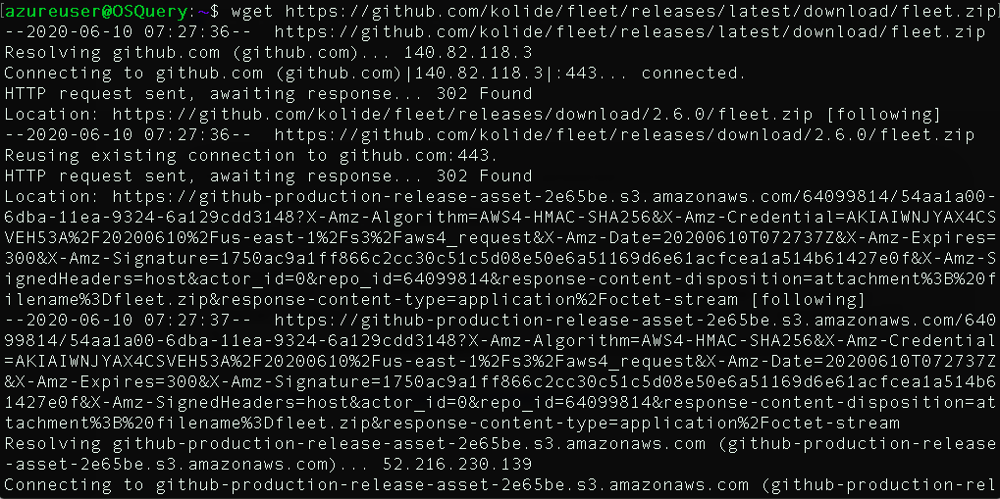

# Red Teaming Attack Simulation with "Atomic Red Team"

Modern organizations face cyber threats on a daily basis. Black hat hackers do not show any indication that they are going to stop. New hacking techniques appear regularly. According to multiple information security reports, the number of APT attacks is increasing in a notable way, targeting national defenses, manufacturing, and the financial industry. Thus, classic protection techniques are, in many cases, useless. Deploying suitable platforms and solutions can help organizations and companies defend against cyber attacks, especially APTs. Some of these platforms are attack simulation tools. In this article we are going to learn how to deploy a red teaming simulation platform called **Atomic Red Team** 

## But first what is  Red teaming? 

Techtarget defines red teaming as follows:

> “Red teaming is the practice of rigorously challenging plans, policies, systems and assumptions by adopting an adversarial approach. A red team may be a contracted external party or an internal group that uses strategies to encourage an outsider perspective.” 

Red Teamers usually perform the following steps:

- Recon
- Initial compromise
- Establish persistence
- Escalate privileges
- Internal Recon
- Lateral movement
- Data analysis
- Exfiltrate and complete mission

[Image source]()

## **Atomic Red Team**

According to its official Github [repository](https://github.com/redcanaryco/atomic-red-team)

  

> _Atomic Red Team allows every security team to test their controls by executing simple &quot;atomic tests&quot; that exercise the same techniques used by adversaries (all mapped to _[_Mitre&#39;s ATT&amp;CK_](https://attack.mitre.org/wiki/Main_Page)_). Atomic Red Team is a library of simple tests that every security team can execute to test their controls. Tests are focused, have few dependencies, and are defined in a structured format that can be used by automation frameworks._

MITRE ATT&amp;CK is a framework developed by the Mitre Corporation. The comprehensive document classifies adversary attacks, in other words, their techniques and tactics after observing millions of real-world attacks against many different organizations. This is why ATT&amp;CK refers to &quot;Adversarial Tactics, Techniques &amp; Common Knowledge&quot;. A tactic is the highest level of attack behaviour. Techniques are used to execute an attack successfully

MITRE framework present the tactics as the following:

1. **Initial Access**
2. **Execution**
3. **Persistence**
4. **Privilege Escalation**
5. **Defense Evasion**
6. **Credential Access**
7. **Discovery**
8. **Lateral Movement**
9. **Collection**
10. **Exfiltration**
11. **Command and Control**

Let&#39;s explore how to install and use Atomic Red Team:

First you need to download the project from here: [https://github.com/redcanaryco/atomic-red-team](https://github.com/redcanaryco/atomic-red-team)

Disable Windows defender

Extract the zip file:

The techniques can be found in the &quot;atomics&quot; folder:

Now Open powershell and type:

`powershell -ExecutionPolicy bypass`

Install a required module:

`Install-Module -Name powershell-yaml`

Now go and download  **Invoke-atomicreadteam**  from: [https://github.com/redcanaryco/invoke-atomicredteam](https://github.com/redcanaryco/invoke-atomicredteam)

_Invoke-AtomicRedTeam is a PowerShell module to execute  __tests__  as defined in the _[_atomics folder_](https://github.com/redcanaryco/atomic-red-team/tree/master/atomics)_ of Red Canary&#39;s Atomic Red  __Team__  project. The &quot;atomics folder&quot; contains a folder for each  __Technique__  defined by the _[_MITRE ATT&amp;CK™ Framework_](https://attack.mitre.org/matrices/enterprise/)_. Inside of each of these &quot;T#&quot; folders you&#39;ll find a  __**yaml**__  file that defines the attack  __procedures__  for each atomic test as well as an easier to read markdown ( __**md**__ )  __version__  of the same data._

Enter the project folder and then type:

`Import-Module ./Invoke-AtomicRedTeam.psm1`

Now you can run any test you want by simply run the following commands:

`$TXXXX = Get-AtomicTechnique -Path \path\to\atomics\TXXXX\TXXXX.yaml`

`Invoke-AtomicTest $TXXXX`

The techniques can be found in the first downloaded project

## References:  [

- [https://bestestredteam.com/2019/07/30/atomic-red-team/](https://bestestredteam.com/2019/07/30/atomic-red-team/)
- [https://bleepsec.com/2018/11/26/using-attack-atomic-red-team-part1.html](https://bleepsec.com/2018/11/26/using-attack-atomic-red-team-part1.html)

