# How to Install and use The Hive Project in Incident Management

In this  module, we are going to explore a great incident management platform called &quot;TheHive Project.&quot;

[Figure](https://blogthehiveproject.files.wordpress.com/2017/12/case3.png)

## The Hive Project 

According to its official Github [repository](https://github.com/TheHive-Project/TheHiveDocs):

[Figure](https://github.com/TheHive-Project/TheHiveDocs/raw/master/images/thehive-logo.png)

> &quot;TheHive is a scalable 4-in-1 open source and free security incident response platform designed to make life easier for SOCs, CSIRTs, CERTs and any information security practitioner dealing with security incidents that need to be investigated and acted upon swiftly. Thanks to [Cortex](https://github.com/TheHive-Project/Cortex/), our powerful free and open-source analysis engine, you can analyze (and triage) observables at scale using more than 100 analyzers.&quot;

To deploy the project you need these hardware requirements:

- _8vCPU_
- _8 GB of RAM_
- _60 GB of disk_

Now let&#39;s explore how to install the project:

First, you need to install Java:

`sudo   apt-get install openjdk-11-jre-headless `

Add the sources:

`echo 'deb https://dl.bintray.com/thehive-project/debian-stable any main' | sudo tee -a /etc/apt/sources.list.d/thehive-project.list`

`curl https://raw.githubusercontent.com/TheHive-Project/TheHive/master /PGP-PUBLIC-KEY | sudo apt-key add -`

Update the system:

`sudo apt-get update`

**Install Elasticsearch**

[Figure](https://encrypted-tbn0.gstatic.com/images?q=tbn:ANd9GcQYUtxYVLaTMM9-M_XRxd0QNpS8PS32iGM5Ukg91_WHmV4nSaRG&amp;s)

`apt-key adv --keyserver hkp://keyserver.ubuntu.com:80 --recv-key D88E42B4`

`echo "deb https://artifacts.elastic.co/packages/5.x/apt stable main" | tee -a/etc/apt/sources.list.d/elastic-5.x.list`

`apt install apt-transport-https`

`apt update`

`sudo apt install elasticsearch`

Install &quot;The Hive&quot;

`sudo apt-get install thehive`

`sudo mkdir /etc/thehive`

    sudo mkdir /etc/thehive
    (cat << _EOF_
    # Secret key
    # ~~~~~
    # The secret key is used to secure cryptographics functions.
    # If you deploy your application to several instances be sure to
    use the same key!
    play.http.secret.key="<ADD A RANDOM STRING HERE>"
    _EOF_
    ) | sudo tee -a /etc/thehive/application.conf
    

`sudo systemctl enable thehive`

`sudo service thehive start `

Now go to your browser and type:

[http://YOUR\_SERVER\_ADDRESS:9000/](http://your_server_address:9000/)

If you want to try it before installing it on your server you download the training VM. You can find it here:

[https://drive.google.com/file/d/1KXL7kzH7Pc2jSL2o1m1\_RwVc3FGw-ixQ/view](https://drive.google.com/file/d/1KXL7kzH7Pc2jSL2o1m1_RwVc3FGw-ixQ/view)

Once you download it, open it with your virtual machine

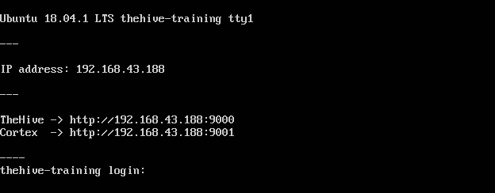

My local IP address is ** 192.168.43.188**. Then to enter TheHive I need to use this URL:   **192.168.43.188:9000**

To access the platform use these credentials:

- **Login: ** admin
- **Password: ** thehive1234

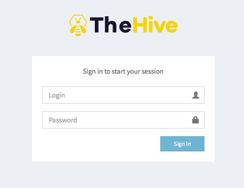

Voila! You are in the main dashboard

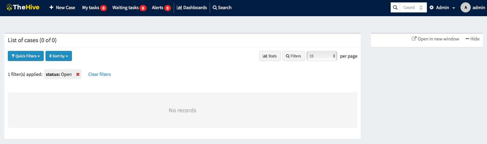

Let&#39;s start exploring how to use TheHive.

**Users**

To create add your team members you need to create users. To create a user go to  **Admin -\&gt; Users** :

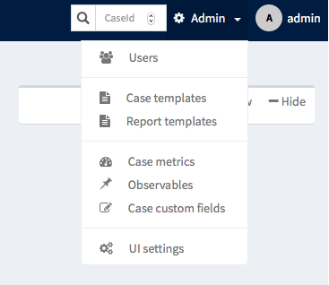

Click on &quot;Add user&quot;

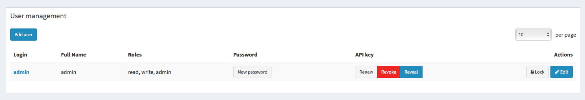

Add your user information

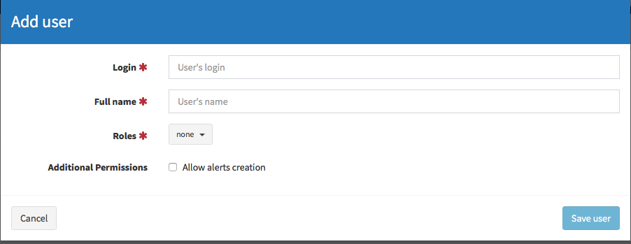

The user was added successfully

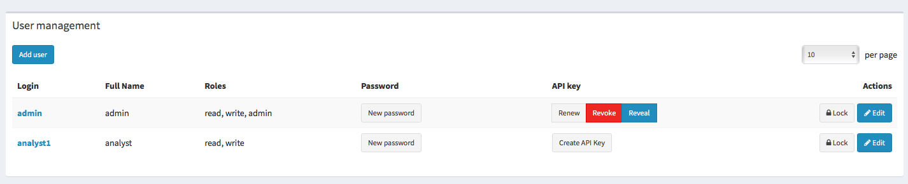

Create a new password for it by clicking &quot; **New password**&quot;, type a password and press enter to save it.

Our password will be &quot; **analyst1**&quot; too.

**Cases: **

To create cases in the Hive, click on &quot; **New case&quot;**

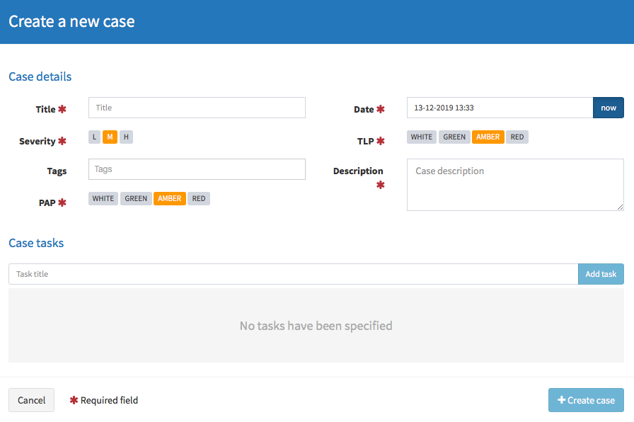

Add your case information:

- _Title_
- _Severity: Low, Medium or High_
- _Date_
- _Tags and so on. _

Add the case tasks:

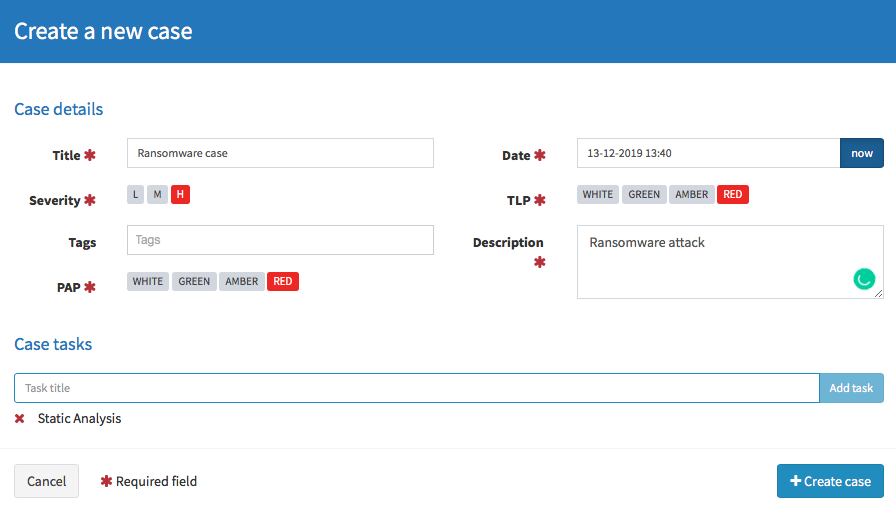

Now we created a case file

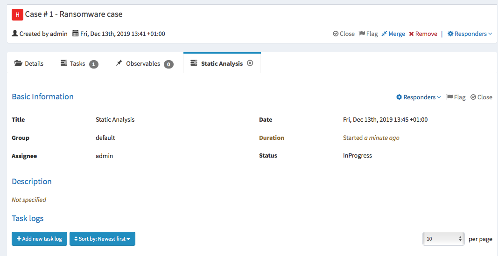

The case file contains also the tasks and the Observables:

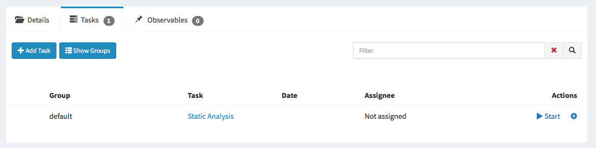

You will find the case in the &quot;Waiting cases&quot; section

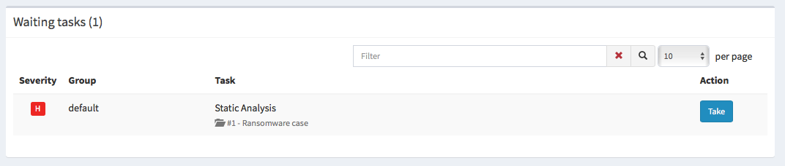

 To take it just click on tasks and it will be added to your &quot;my tasks&quot; section

Once you finish the case, click on &quot;Close&quot; and it will be closed

**Dashboards**

To visualize your cases statistics you need to use The Hive dashboards. To open or create a new dashboard go to &quot;Dashboards&quot;

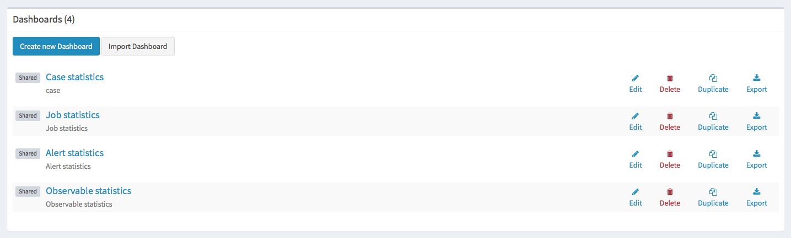

Select any available dashboard to explore it

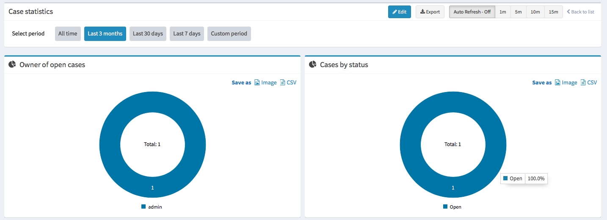

**Cortex:**

Its developers define cortex as follows:

> &quot;Thanks to Cortex, observables such as IP and email addresses, URLs, domain names, files or hashes can be analyzed using a Web interface. Analysts can also automate these operations and submit large sets of observables from TheHive or through the Cortex REST API from alternative SIRP platforms, custom scripts or MISP. When used in conjunction with TheHive, Cortex largely facilitates the containment phase thanks to its Active Response features.&quot;

The following graph illustrates Cortex architecture:

[Figure](https://github.com/TheHive-Project/Cortex/raw/master/images/Architecture.png)

To enter cortex type this address on your browser: http://YOUR_SERVER_ADDRESS:9001/

Login to cortex using the same credentials as The hive

- Login: admin
- Password: thehive1234

This is the main dashboard of &quot;Cortex&quot;

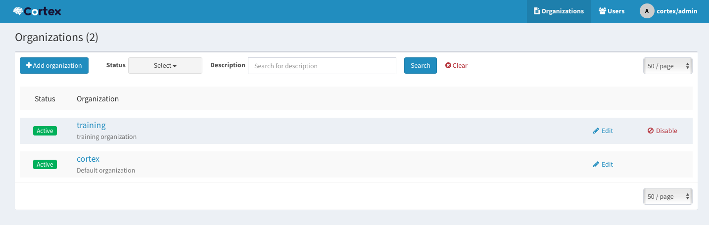

## Summary  

In this guide, we discovered a great incident management platform called &quot;the Hive&quot; where we saw how to install it and use it to manage your team cases.

### References:  

-  Recommendations of the National Institute of Standards and Technology: Computer Security Incident Handling Guide: [https://nvlpubs.nist.gov/nistpubs/specialpublications/nist.sp.800-61r2.pdf](https://nvlpubs.nist.gov/nistpubs/specialpublications/nist.sp.800-61r2.pdf)
-  Computer Security Incident Response Team (CSIRT) : [http://whatis.techtarget.com/definition/Computer-Security-Incident-Response-Team-CSIRT](http://whatis.techtarget.com/definition/Computer-Security-Incident-Response-Team-CSIRT)
-  US-CERT | United States Computer Emergency Readiness Team : [https://www.us-cert.gov/about-us](https://www.us-cert.gov/about-us)

