#  Incident Response and Threat hunting with OSQuery and Kolide Fleet 

In this guide, we are going to explore some powerful tools to help you enhance your incident response and threat hunting assessments. These tools are OSQuery and Kolide Fleet.

Image source: [Kolide Fleet dashboard](https://github.com/kolide/fleet/raw/master/assets/images/dashboard-screenshot.png)

Let&#39;s start exploring the first tool OSQuery

##  OSQuery Overview 

According to its official Github [repository](https://github.com/osquery/osquery):

> _Osquery is a __ __ SQL __ __ powered __ __ operating system __ __ instrumentation, __ __ monitoring __, and__   __analytics__   __framework. It is Available for__   __Linux__ , __ __ macOS __,__   __Windows,__  __and FreeBSD._

Its official website is [https://osquery.io](https://osquery.io/)

To download OSQuery visit: [https://osquery.io/downloads/official/4.3.0](https://osquery.io/downloads/official/4.3.0)

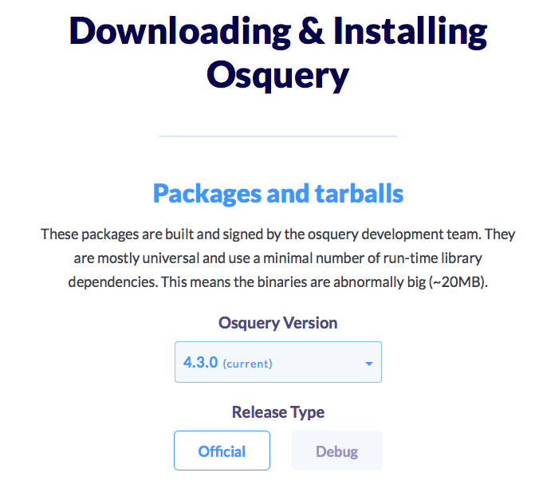

For the demonstration, we are going to use a Ubuntu 18.04 TLS server machine. To install it on our Ubuntu server type the following commands:

`export OSQUERY\_KEY=1484120AC4E9F8A1A577AEEE97A80C63C9D8B80B`

`sudo apt-key adv --keyserver hkp://keyserver.ubuntu.com:80 --recv-keys $OSQUERY\_KEY`

sudo add-apt-repository &#39;deb [arch=amd64] [https://pkg.osquery.io/deb](https://pkg.osquery.io/deb) deb main&#39;

`sudo apt-get update`

`sudo apt-get install osquery`

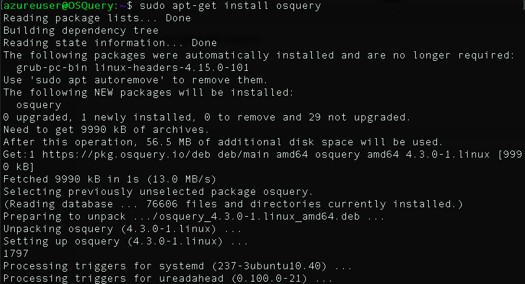

OSQuery delivers these modes:

- **Osqueryi: ** Interactive shell
- **Osqueryd: ** Deamon

To start using OSQuery simply type:

`osqueryi`

To explore the available commands type  **.help**

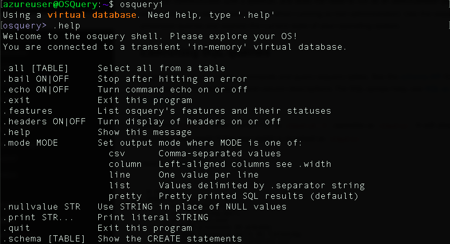

To explore the available tables type

`.tables`

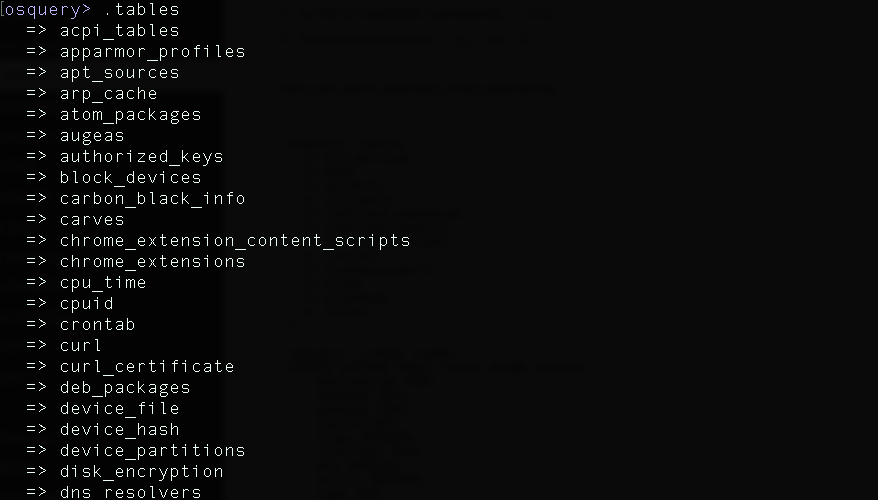

To explore the schema of a specific table type

`.schema \&lt;TABLE\_HERE\&gt;`

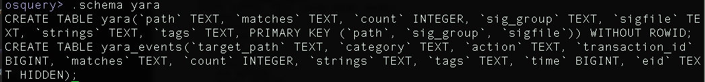

For example if you want to get the users type:

`select \* from users ;`

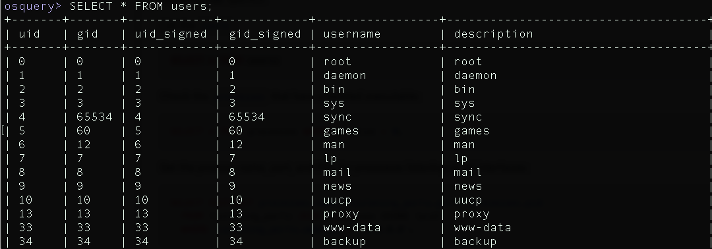

To select loggedin users type:

`select \* from logged\_in\_users ;`

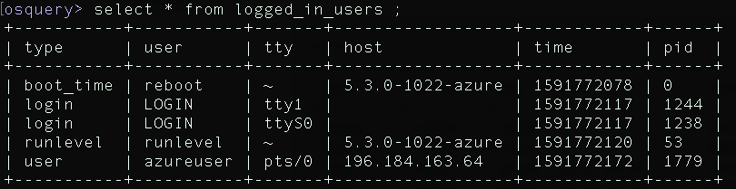

The official website contains the list of all the available tables and its schemes. For example this is the scheme of  **Kernel\_info table**

For example to select the version of the kernel type:

`select version from Kernel\_info`

Let&#39;s suppose that you want to automate a specific query (selecting users) every 300 seconds. Edit the  **/etc/osquery/osquery.conf  ** file and add your rules

&quot;schedule&quot;: {
 &quot;Users&quot;: {
 &quot;query&quot;: &quot;SELECT \* FROM users;&quot;,
 &quot;interval&quot;: 300
 }
 },

A collection of queries is called a ** Pack**. OSQuery provides many hekpful packs that you can use in your assessments here: [https://github.com/osquery/osquery/tree/master/packs](https://github.com/osquery/osquery/tree/master/packs)

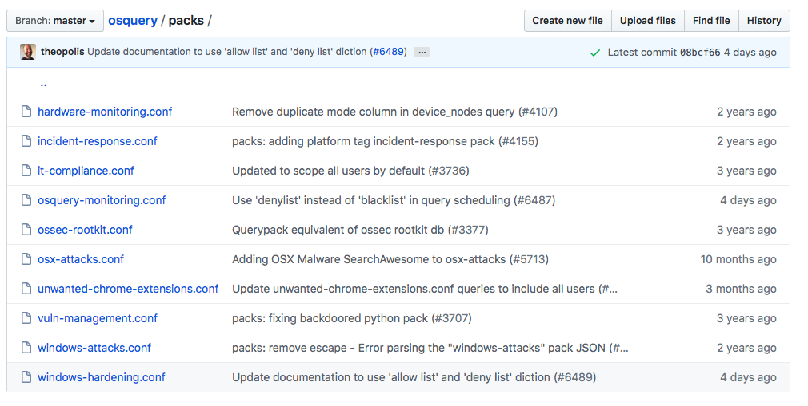

This is a query from [https://github.com/osquery/osquery/blob/master/packs/incident-response.conf](https://github.com/osquery/osquery/blob/master/packs/incident-response.conf)  that retreive all the startup items in MacOS hosts:

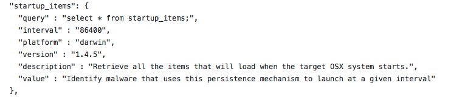

But now, what to do if we want to deploy OSQuery in large scale environments and we want to manage them all easily. In this situation we need another powerful platform called &quot;Kolide Fleet&quot;

##  Kolide Fleet (OSQuery Management)

According to its official [Github repository](https://github.com/kolide/fleet):

> _Fleet is the most widely used __ __ open-source __ __ osquery Fleet manager. Deploying osquery with Fleet enables live queries, and effective __ __ management __ __ of osquery infrastructure._

Image source: [Kolide fleet ](https://miro.medium.com/max/1400/1*t17v4ZaUn-4Nz7tmAJWElQ@2x.png)

To install it use the following commands:

wget [https://github.com/kolide/fleet/releases/latest/download/fleet.zip](https://github.com/kolide/fleet/releases/latest/download/fleet.zip)

`sudo apt-get install unzip`

Unzip the file:

`sudo unzip fleet.zip`

Enter the linux folder:

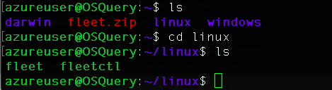

Copy the binaries in /usr/bin

sudo cp \* /usr/bin/

Install this required program:

`sudo apt install software-properties-common`

  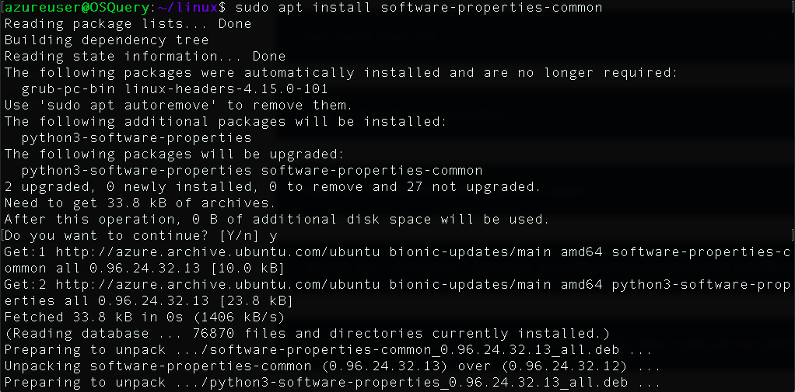

`sudo apt-key adv --recv-keys --keyserver hkp://keyserver.ubuntu.com:80 0xF1656F24C74CD1D8`

add-apt-repository &#39;deb [arch=amd64,arm64,ppc64el] [http://sfo1.mirrors.digitalocean.com/mariadb/repo/10.4/ubuntu](http://sfo1.mirrors.digitalocean.com/mariadb/repo/10.4/ubuntu) bionic main&#39;

`sudo apt-get update`

Install Maria database server and its client:

`sudo apt install mariadb-server mariadb-client`

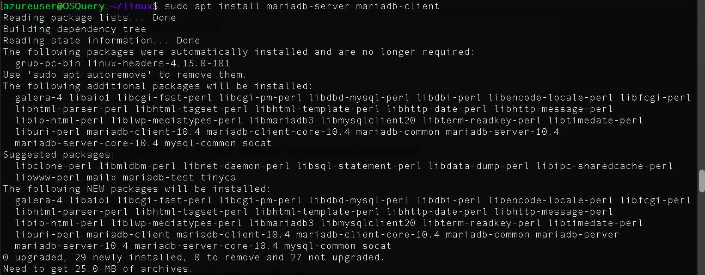

Check its status:

`sudo systemctl status mariadb`

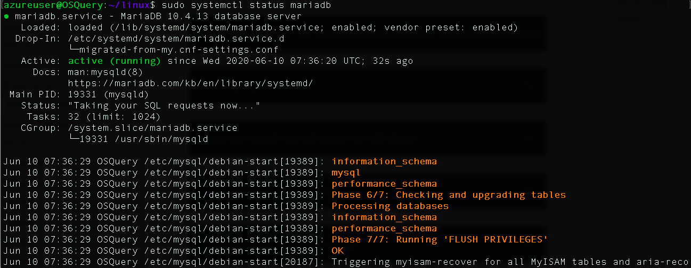

Enable Mariadb service:

`sudo systemctl is-enabled mariadb`

Enter mysql and type the following commands:

`sudo mysql -u root -p`

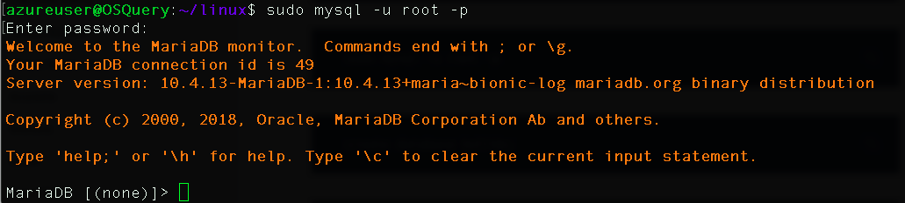

create database kolide;

grant all on kolide.\* to kolideuser@localhost identified by &#39;Passw0rd!&#39;;

`flush privileges;`

`exit`

Install Redis:

`sudo apt install redis`

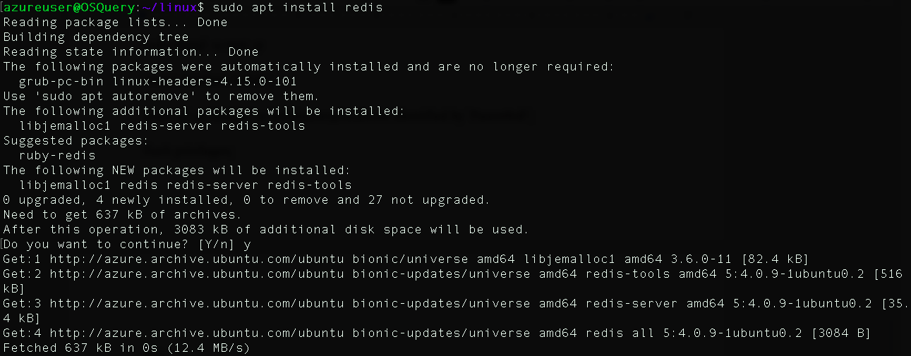

Prepare fleet:

fleet prepare db --mysql\_address=127.0.0.1:3306 --mysql\_database=kolide --mysql\_username=kolideuser --mysql\_password=Passw0rd!

fleet serve --mysql\_address=127.0.0.1:3306 \

 --mysql\_database=kolide --mysql\_username=kolideuser --mysql\_password=Passw0rd! \

 --server\_cert=/etc/ssl/certs/kolide.cert --server\_key=/etc/ssl/private/kolide.key \

 --logging\_json

sudo fleet serve --mysql\_address=127.0.0.1:3306 \

 --mysql\_database=kolide --mysql\_username=kolideuser --mysql\_password=Passw0rd! \

 --server\_cert=/etc/ssl/certs/kolide.cert --server\_key=/etc/ssl/private/kolide.key \

 --logging\_json --auth\_jwt\_key=9yKI2MeThUSLtsYiCS7etUSJZD1lgHLr

Start fleet:

Go to https://\&lt;SERVER\_IP\&gt;:8080

Provide your username, password and email

Add your organization name, the organization domain name/IP  and submit:

Voila! Kolide fleet is deployed successfully.

Now let&#39;s add our host. To do so, click on &quot;ADD NEW HOST&quot; and you will get this window. It provides a key called &quot;OSQuery enroll secret&quot; that we are going to use later.

To add the host, we need to install the fleet launcher. In our case we are using the same host.

wget [https://github.com/kolide/launcher/releases/download/v0.11.10/launcher\_v0.11.10.zip](https://github.com/kolide/launcher/releases/download/v0.11.10/launcher_v0.11.10.zip)

Unzip the file:

'sudo unzip launcher\_v0.11.10.zip'

Enter the Linux file:

`cd linux`

Start the launcher

./launcher --hostname=127.0.0.1:8080 --root\_directory=$(mktemp -d) --enroll\_secret=\&lt;COPY SECRET KEY HERE\&gt; --insecure

Congratulation! if you refresh the Kolide fleet dashboard you will see the newly added host

To run and add queries go to  **QUERY**  -\&gt;  **New Query**

Type the SQL Query

Select the targets/hosts

Click on &quot;Run&quot;. You will get the query outputs below:

## References

1. [https://medium.com/@sroberts/osquery-101-getting-started-78e063c4e2f7](https://medium.com/@sroberts/osquery-101-getting-started-78e063c4e2f7)
2. [https://www.digitalocean.com/community/tutorials/how-to-monitor-your-system-security-with-osquery-on-ubuntu-16-04](https://www.digitalocean.com/community/tutorials/how-to-monitor-your-system-security-with-osquery-on-ubuntu-16-04)

