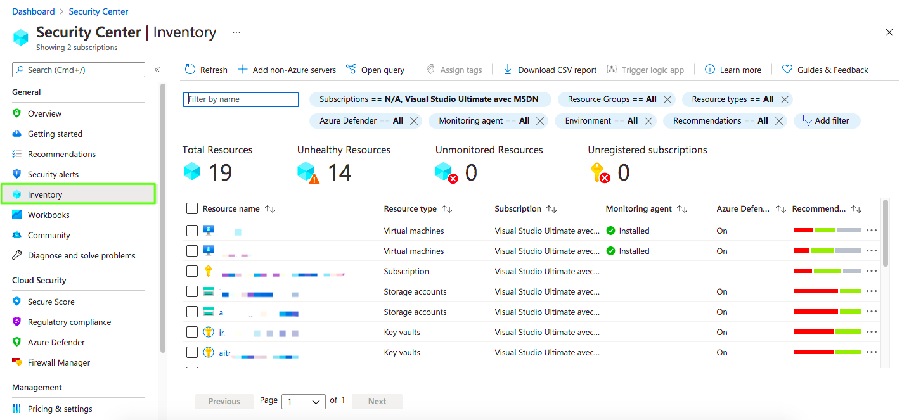
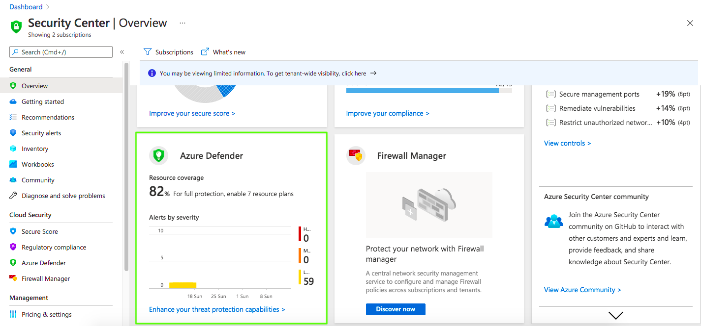

Cloud Security Cyber Hygiene

# 1. Why Cyber Hygiene is important?  

    

> “Great things are done by a series of small things brought together.“ - Vincent Van Gogh 

Modern organizations face cyber threats on a daily basis. Black hat hackers do not show any indication that they are going to stop. Thus, it is essential for every organization to protect its assets and its clients against these threats. Information security is a journey and cannot be achieved overnight. Furthermore, organizations do not need the next {AI-ML-Nextgen-blockchain- put any buzzword here} security product to secure your organization, but if you need to protect your organization and users, it is essential to take the first steps. Small actions can take you so far in your cybersecurity journey.

***Do you have an idea how many data breaches and cyber-attacks could be avoided by taking small actions like simply enabling MFA or by updating and patching a system?***

That is why ***“Security Hygiene”*** is very important. Security hygiene is simply a set of small actions and best practices that can be performed to protect the organization and enhance its security posture. There are many security hygienes principles that you can follow immediately. Some of them are the following:

* Patching and updating systems
* Enabling MFA
* Asset Inventory and management
* User awareness and education 
* Privileged accounts protection 
* Installing AV solutions
* Maintaining a cybersecurity policy 

# 2. Security Hygiene with Azure Security Center

> “I am always doing what I cannot do yet, in order to learn how to do it.” - Vincent Van Gogh

Now let’s explore how Azure Security Center can help you in your cyber hygiene journey. Microsoft documentation describes Azure Security Center as follows: 

> “Azure Security Center is a unified infrastructure security management system that strengthens the security posture of your data centers, and provides advanced threat protection across your hybrid workloads in the cloud - whether they're in Azure or not - as well as on-premises.” 

    

    

## Secure Score

You can’t enhance what you can’t measure. That is why one of the most helpful metrics provided by the Security Center is “Secure Score”. Secure Score is an aggregation of many values and assessment results to give you a clear idea about your current security situation and per consequence to help you track your situation. The score is represented as a percentage and it is calculated as follows:

    

([Source](https://docs.microsoft.com/en-us/azure/security-center/secure-score-security-controls))

    

To raise the “secure score”, you need to take actions based on the provided recommendations. For example, if you enable MFA, 10 points will be added to your score. More details about the scure score calculation can be found here: https://docs.microsoft.com/en-us/azure/security-center/secure-score-security-controls 

## Recommendations

Recommendations can be found simply by selecting the “Recommendations” link in the side menu. The recommendations page gives you helpful insights about your resource health. 

    

Resource health is identified based on a pre-defined list of security controls. You need to remediate the provided security controls to increase the “Secure score”. Thus your security posture will increase accordingly. 

    

Some insights about the recommendations are shown on the main page of the security center 

    

Visibility is very important when it comes to information security and especially in security hygiene. Azure Security Center gives you clear visibility for your assets and resources on the “Inventory” page. 

    

Furthermore, it is possible to check the coverage by exploring the “coverage” page, where you can identify the covered Azure subscriptions. 

    

## Regulatory Compliance

Many organizations need to be aligned and compliant with industry and regulatory standards, and benchmarks. Azure Security Center saves your precious time and provides you with a regulatory compliance section where you can ensure how your organization is aligned with industry standards or internal policies.

    

To explore it, simply select the “Regulatory compliance” page. For example, as a start, you are provided with “Azure Security Benchmark v2”. 

> “The Azure Security Benchmark (ASB) provides prescriptive best practices and recommendations to help improve the security of workloads, data, and services on Azure.” (Source: https://docs.microsoft.com/en-us/security/benchmark/azure/overview )

    

You can enable and disable the standards

    

Furthermore, you can add regulatory compliance standards from a list provided by the security center to help you start right away. 

    

## Azure Defender

Azure defender is integrated with the Security center and it helps you protect your hybrid resources and workloads. According to Microsoft documentation: 

“Azure Defender provides security alerts and advanced threat protection for virtual machines, SQL databases, containers, web applications, your network, and more.” 

    

Azure Defender is not enabled per default. 

    

Alerts are shown on the “Security Alerts” page where you can see the triggered alerts with different severities and the affected resources. 

    

If you select a specific alert you will get more details about it

    

Alert status can be changed by clicking on the status option: 

    

Not only alert details are presented. The “take action” option gives you the ability to mitigate the threats and even trigger automated tasks.

    

Alerts are mapped to the MITRE ATT&CK Framework. MITRE ATT&CK is a framework developed by the Mitre Corporation. The comprehensive document classifies adversary attacks, in other words, their techniques and tactics after observing millions of real-world attacks against many different organizations. This is why ATT&CK refers to "Adversarial Tactics, Techniques & Common Knowledge".

    

Nowadays the frameworks provide different matrices: Enterprise, Mobile, and PRE-ATT&CK. Each matrix contains different tactics and each tactic has many techniques.

    

Tactics, Techniques, and procedures (TTPs) are how the attackers are going to achieve their mission. A tactic is the highest level of attack behaviour. 
The PRE-ATT&CK MITRE framework present the 15 tactics as the following:

1. Priority Definition Planning
2. Priority Definition Direction
3. Target Selection
4. Technical Information Gathering
5. People Information Gathering
6. Organizational Information Gathering
7. Technical Weakness Identification
8. People Weakness Identification
9. Organizational Weakness Identification
10. Adversary OPSEC
11. Establish & Maintain Infrastructure
12. Persona Development
13. Build Capabilities
14. Test Capabilities
15. Stage Capabilities

    

Azure Security Center gives you the ability to integrate workloads from other cloud providers such as AWS and Google GCP. To connect your cloud accounts select the “Cloud Connectors” page. 

    

# 3. Take Actions Now

> "What would life be if we had no courage to attempt anything?" - Vincent Van Gogh

