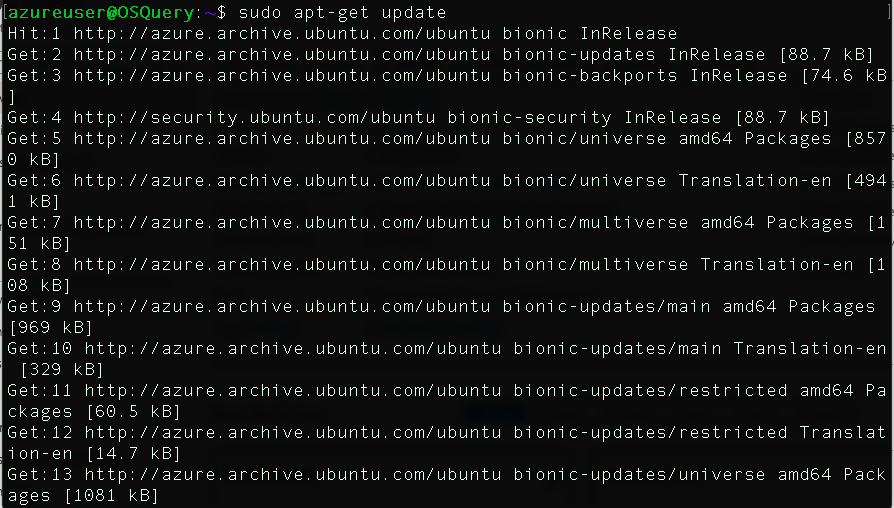
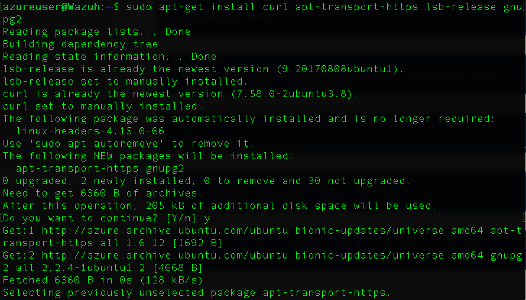
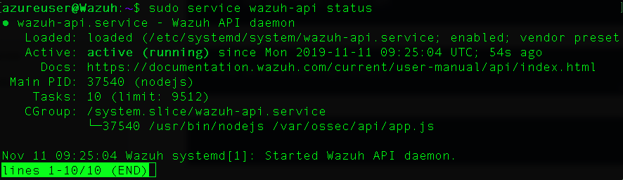
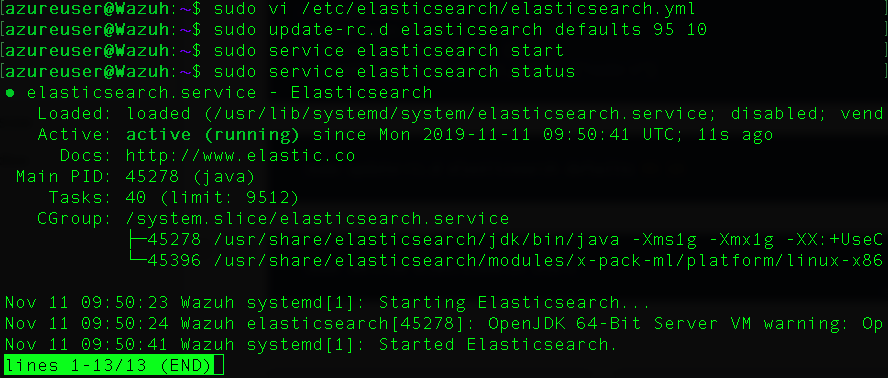
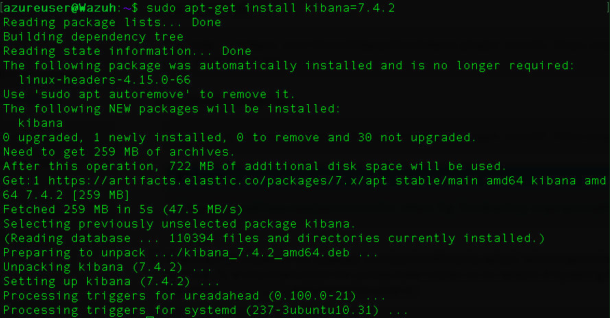

# **Hands-on Wazuh Host-based Intrusion Detection System (HIDS) Deployment**

Hi Peerlysters,

In this article we are going to learn how to deploy a powerful HIDS called &quot;Wazuh&quot;

_[Image Source](https://1.bp.blogspot.com/-cLWhyj0UdO8/Vqvp68xMPHI/AAAAAAAAHA4/c1NJZ803AaE/s1600/WazuhDashboard.JPG)_

## What is an intrusion detection system?

 Intrusion detection systems are a set of devices or pieces of software that play a huge role in modern organizations to defend against intrusions and malicious activities.We have two major intrusion detection system categories:

- **Host Based Intrusion Detection Systems (HIDS):** they run on the enterprise hosts to detect host attacks
- **Network Based Intrusion Detection Systems (NIDS):** their role is to detect network anomalies by monitoring the inbound and outbound traffic.

The detection can be done using two intrusion detection techniques:

- **Signature based detection technique:**  the traffic is compared against a database of signatures of known threats
- Anomaly-based intrusion technique: inspects the traffic based on the behavior of activities.

## How to Deploy Wazuh HIDS?

According to its official website: [https://wazuh.com](https://wazuh.com/)

> Wazuh is a free, open source and enterprise-ready security monitoring solution for threat detection, integrity monitoring, incident response and compliance.
Wazuh is used to collect, aggregate, index and analyze security data, helping organizations detect intrusions, threats and behavioral anomalies.

_Wazuh is used to collect, aggregate, index and analyze security data, helping organizations detect intrusions, threats and behavioral anomalies._

It contains the following components:

- **Wazuh server**
- **Elastic Stack**
- **Wazuh agent**

Now let&#39;s explore how to deploy it. For the demonstration i am using a Ubuntu 18.04 VM.

`sudo apt-get update`

`sudo apt-get installcurl apt-transport-https lsb-release gnupg2`

Install the GPG key:

`wget -qO - https://artifacts.elastic.co/GPG-KEY-elasticsearch | sudo apt-key add -`

Add the repository

`echo "deb https://artifacts.elastic.co/packages/7.x/apt stable main" | sudo tee -a /etc/apt/sources.list.d/elastic-7.x.list`

Update the package information:

`sudo apt-get update`

**Installing the Wazuh manager**

On your terminal, install the Wazuh manager:

`sudo apt-get install wazuh-manager`

Once the process is completed, you can check the service status with:

`service wazuh-manager status`

Installing the Wazuh API:

NodeJS \&gt;= 4.6.1 is required in order to run the Wazuh API.

`sudo curl -sL https://deb.nodesource.com/setup_8.x | sudo  bash -`

and then, install NodeJS:

`sudo apt-get install nodejs`

Install the Wazuh API:

`sudo apt-get install wazuh-api`

Once the process is complete, you can check the service status with:

`sudo service wazuh-api status`

**Installing Filebeat**

`apt-get install filebeat=7.4.2`

This is pre-configuration to forward Wazuh alerts to Elasticsearch

`curl -so /etc/filebeat/filebeat.yml https://raw.githubusercontent.com/wazuh/wazuh/v3.11.4/extensions/filebeat/7.x/filebeat.yml`

Download the alerts template for Elasticsearch

`curl -so /etc/filebeat/wazuh-template.json https://raw.githubusercontent.com/wazuh/wazuh/v3.11.4/extensions/elasticsearch/7.x/wazuh-template.json`

Download the Wazuh module for Filebeat:

`curl -s https://packages.wazuh.com/3.x/filebeat/wazuh-filebeat-0.1.tar.gz | sudo tar -xvz -C /usr/share/filebeat/module`

`sudo vi /etc/filebeat/filebeat.yml`

Enable and start the Filebeat service:

`sudo update-rc.d filebeat defaults 95 10`

`sudo service filebeat start`

## Installing Elastic Stack

Elasticsearch is a powerful open source distributed, RESTful, JSON-based search engine.You can see it as a search server.It is a NoSQL database.To install elasticsearch we need to make sure that we are already installed Java.

`sudo apt-get install elasticsearch=7.4.2`

` sudo vi /etc/elasticsearch/elasticsearch.yml`

    node.name: node-1
    network.host: ["0.0.0.0"]
    http.port: 9200
    discovery.seed_hosts: []
    cluster.initial_master_nodes: ["node-1"]

`sudo update-rc.d elasticsearch defaults 95 10`

` sudo service elasticsearch start`

Once Elasticsearch is up and running, it is recommended to load the Filebeat template. Run the following command where Filebeat was installed:

`sudo filebeat setup --index-management -E setup.template.json.enabled=false`

## Installing Kibana

Kibana is a Web interface for searching and visualizing logs. It is a data-log dashboard. It contains pie charts, bars, heat maps, bubble charts and scatter plots. It is an amazing solution to visualize your data and detect any unusual patterns

`apt-get install kibana=7.4.2`

Install the Wazuh app plugin for Kibana

`sudo -u kibana bin/kibana-plugin install https://packages.wazuh.com/wazuhapp/wazuhapp-3.11.4_7.6.1.zip`

`sudo vi /etc/kibana/kibana.yml`

    server.port: 5601
    server.host: 0.0.0.0
    elasticsearch.hosts: ["http://localhost:9200"]

`sudo update-rc.d kibana defaults 95 10`

` service kibana start`

**Transform  data with Logstash (Optional)**

Logstash is an open source to collect,parse and transform logs.

`sudo apt-get install logstash=1:7.4.2-1`

` sudo systemctl daemon-reload`

` sudo systemctl enable logstash`

Download the Wazuh configuration file for Logstash

 sudo systemctl restart logstash

 sudo vi /etc/filebeat/filebeat.yml\&lt;/a

Configure the Filebeat instance, change the events destination from Elasticsearch instance to the Logstash instance.

Disable Elasticsearch Output:

Add:

output.logstash.hosts: [&quot;localhost:5000&quot;]

sudo systemctl restart filebeat

Check if Logstash is reachable from Filebeat.

sudo filebeat test output

Replace the default credentials with your desired username where myUsername is shown below to protect your Wazuh API

More information: [https://documentation.wazuh.com/3.3/installation-guide/installing-elastic-stack/connect\_wazuh\_app.html](https://documentation.wazuh.com/3.3/installation-guide/installing-elastic-stack/connect_wazuh_app.html)

Open a web browser and go to the Elastic Stack server&#39;s IP address on port 5601 (default Kibana port). Then, from the left menu, go to the Wazuh App.

Click on &quot;Add new API&quot; and fill the API fields. If everything goes fine, you will get this main Wazuh dashboard.

To add new agent just select the OS, curl the package and install it:

